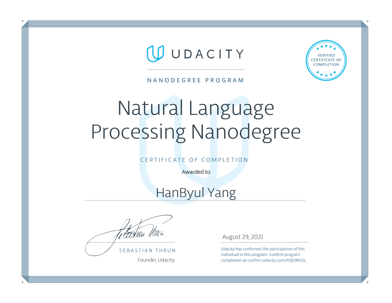

# nd892 - Natural Language Processing Nanodegree

This is my personal repository for Natural Language Processing Nanodegree Program at [Udacity](https://udacity.com).
It has classroom materials and project results.

## [Projects](https://github.com/yhbyhb/artificial-intelligence/tree/master/Projects)
  1. [Part of Speech Tagger](https://github.com/yhbyhb/artificial-intelligence/tree/master/Projects/4_HMM%20Tagger)
  2. [Machine Translation](https://github.com/yhbyhb/aind2-nlp-capstone)
  3. [DNN Speech Recognizer](https://github.com/yhbyhb/DNN_Speech_Recognizer)
